# 🏎️ Lights Out and Away — F1 ML Project


> **Predicting F1 Race Winners and Pit Stop Durations using Supervised Machine Learning**

A complete machine learning project that uses real Formula 1 data from the 2022, 2023, and 2024 seasons to predict race winners and pit stop durations using Linear Regression and K-Nearest Neighbors algorithms.

---

## 📑 Table of Contents

- [What is This Project?](#-what-is-this-project)
- [Dataset](#-dataset)
- [Problem 1: Race Winner Prediction](#-problem-1-race-winner-prediction)
- [Problem 2: Pit Stop Duration Prediction](#-problem-2-pit-stop-duration-prediction)
- [Algorithms Used](#-algorithms-used)
- [ML Concepts Covered](#-ml-concepts-covered)
- [Results](#-results)
- [Visualizations](#-visualizations)
- [Installation](#-installation)
- [How to Run](#-how-to-run)
- [Project Structure](#-project-structure)
- [Acknowledgements](#-acknowledgements)

---

## 🏁 What is This Project?

Formula 1 generates millions of data points every race weekend. This project applies supervised machine learning to real F1 data to solve two prediction problems:

1. **Can we predict who will win a race** based on qualifying position, team, weather, and circuit?
2. **Can we predict how long a pit stop will take** based on team, tyres, lap number, and conditions?

We compare **Linear Regression** and **K-Nearest Neighbors (KNN)** on both problems, evaluating them with standard ML metrics and visualizing the results with 26+ professional, F1-themed plots.

---

## 📊 Dataset

### Data Source: FastF1 Python Library

[FastF1](https://docs.fastf1.dev/) is an open-source Python library that provides access to official F1 timing and telemetry data. We use it to collect:

| Data Type | Description | Key Columns |
|-----------|-------------|-------------|
| **Race Results** | Final positions, points | Position, GridPosition, Points |
| **Qualifying** | Grid positions | QualifyingPosition, Q1/Q2/Q3 Times |
| **Pit Stops** | Duration per stop | PitStopDuration, LapNumber, Compound |
| **Weather** | Session conditions | AirTemp, TrackTemp, Humidity, Rainfall |
| **Circuit** | Track information | CircuitName, Country, TotalLaps |
| **Tyres** | Stint-level compound data | Compound, StintLength, TyreLife |

### Seasons Covered

| Season | Races | Status |
|--------|-------|--------|
| 2022 | Up to 22 | ✅ Collected |
| 2023 | Up to 22 | ✅ Collected |
| 2024 | 24 | ✅ Collected |

### 2024 Race Calendar

Bahrain • Saudi Arabia • Australia • Japan • China • Miami • Emilia Romagna • Monaco • Canada • Spain • Austria • Great Britain • Hungary • Belgium • Netherlands • Italy • Azerbaijan • Singapore • United States • Mexico • Brazil • Las Vegas • Qatar • Abu Dhabi

---

## 🏆 Problem 1: Race Winner Prediction

**Target Variable:** `Position` (1 = winner, 2 = second place, etc.)

**Features:**
| Feature | Description |
|---------|-------------|
| GridPosition | Qualifying position (starting grid) |
| TeamEncoded | Team name (label encoded) |
| DriverEncoded | Driver name (label encoded) |
| CircuitEncoded | Circuit name (label encoded) |
| AirTemp | Race day air temperature (°C) |
| TrackTemp | Race day track temperature (°C) |
| Rainfall | Did it rain during the race? (0/1) |
| AvgPitStops | Average pit stops per driver for that race |
| StartingCompoundEncoded | Starting tyre compound (label encoded) |

**Models:**
- **Linear Regression** — predicts position as a continuous value
- **KNN Classifier** — classifies finishing position, focused on predicting P1

---

## ⏱️ Problem 2: Pit Stop Duration Prediction

**Target Variable:** `PitStopDuration` (seconds)

**Features:**
| Feature | Description |
|---------|-------------|
| TeamEncoded | Team name (label encoded) |
| TyreCompoundEncoded | Tyre compound (label encoded) |
| LapNumber | Lap on which pit stop occurred |
| CircuitEncoded | Circuit name (label encoded) |
| AirTemp | Air temperature (°C) |
| TrackTemp | Track temperature (°C) |
| TyreAge | Laps on current tyre set |
| RaceYear | Year of the race (2022/2023/2024) |
| DriverEncoded | Driver name (label encoded) |

**Models:**
- **Linear Regression** — predicts pit stop duration
- **KNN Regressor** — predicts pit stop duration

---

## 🤖 Algorithms Used

### Linear Regression
A supervised learning algorithm that models the relationship between features and a continuous target as a linear function. It learns coefficients (weights) for each feature that minimize the sum of squared errors between predictions and actual values.

**When it works well:** When the relationship between features and target is approximately linear.

### K-Nearest Neighbors (KNN)
A non-parametric algorithm that makes predictions based on the K most similar examples in the training data. For classification (Problem 1), it uses majority voting; for regression (Problem 2), it averages the neighbors' values.

**When it works well:** When decision boundaries are non-linear and the dataset is not too large.

---

## 📚 ML Concepts Covered

- ✅ Supervised Learning (Regression & Classification)
- ✅ Train/Test Split (80/20)
- ✅ Feature Engineering and Encoding
- ✅ Feature Scaling (StandardScaler)
- ✅ Hyperparameter Tuning (K selection for KNN)
- ✅ Cross-Validation (5-fold)
- ✅ Model Evaluation Metrics (MSE, RMSE, MAE, R², Accuracy, Precision, Recall, F1)
- ✅ Confusion Matrix
- ✅ Residual Analysis
- ✅ Learning Curves
- ✅ Feature Importance
- ✅ Model Comparison

---

## 📈 Results

### Problem 1: Race Winner Prediction

| Metric | Linear Regression | KNN Classifier (K=4) |
|--------|------------------|----------------------|
| MSE | 28.76 | 63.53 |
| RMSE | 5.36 | 7.97 |
| MAE | 4.39 | 6.45 |
| R² Score | 0.099 | -0.991 |
| Accuracy | N/A | 0.036 |
| Precision | N/A | 0.026 |
| Recall | N/A | 0.036 |
| F1 Score | N/A | 0.026 |
| CV RMSE (5-fold) | 5.20 ± 0.11 | — |
| CV Accuracy (5-fold) | — | 0.079 ± 0.021 |

**🏆 Winner: Linear Regression** — lower RMSE (5.36 vs 7.97)

> Grid position is the strongest predictor of finishing position, confirming qualifying as the key to F1 race outcomes.

### Problem 2: Pit Stop Duration Prediction

| Metric | Linear Regression | KNN Regressor (K=20) |
|--------|------------------|----------------------|
| MSE | 9.13 | 9.29 |
| RMSE | 3.02 s | 3.05 s |
| MAE | 1.22 s | 1.28 s |
| R² Score | -0.002 | -0.019 |
| CV RMSE (5-fold) | 2.88 ± 0.29 | 2.95 ± 0.27 |
| Residual Mean | 0.06 | 0.07 |
| Residual Std | 3.02 | 3.05 |

**🏆 Winner: Linear Regression** — lower RMSE (3.02s vs 3.05s)

---

## 🎨 Visualizations

All 26+ visualizations use a custom F1 dark-navy theme with official team and tyre colors.

### 🗓️ Race Calendar — Data Overview
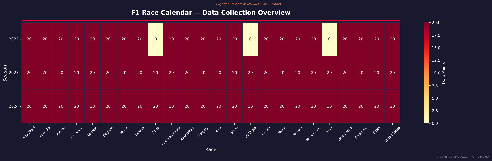
*All 24 races across 3 seasons colored by data points collected*

### 🏆 Constructor Championship Points
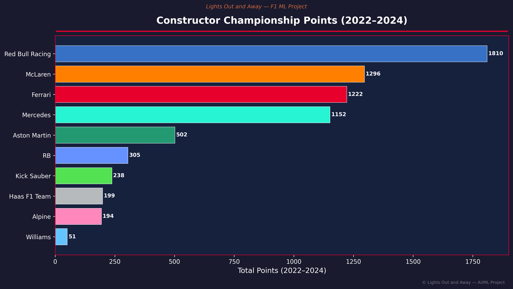
*Total points per constructor 2022–2024, colored by official team colors*

### 🏎️ Driver Performance Radar
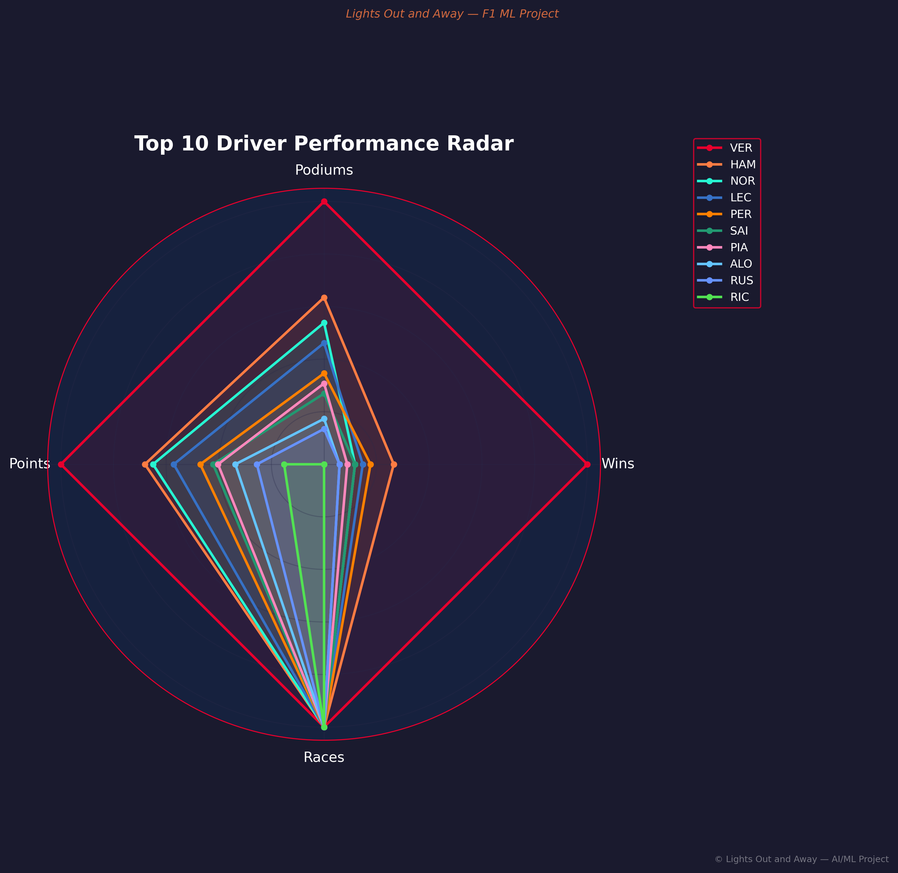
*Top 10 drivers across wins, podiums, points, and races*

### 📍 Grid Position vs Finishing Position
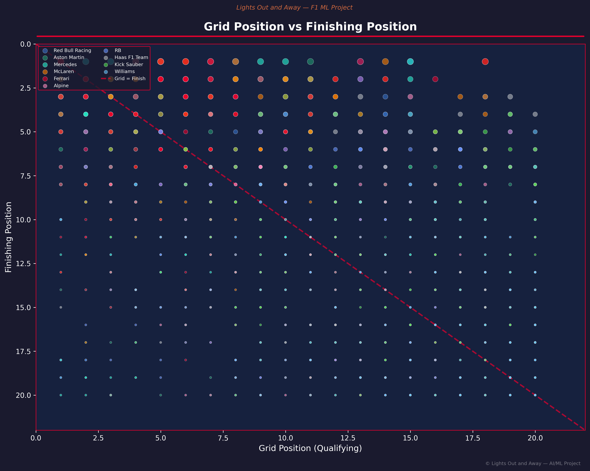
*Strong correlation between qualifying and race result — key ML insight*

### 📐 Linear Regression — Actual vs Predicted (Race Winner)
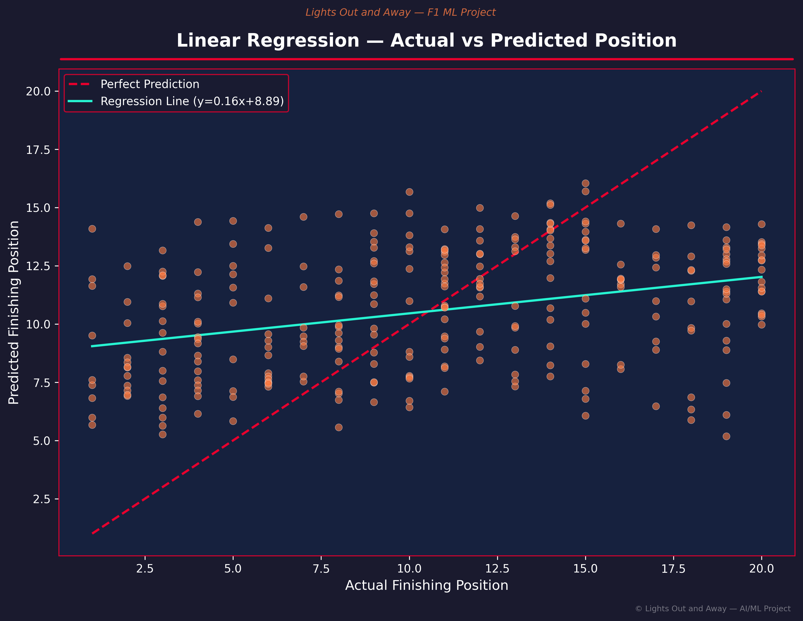
*Linear Regression predictions vs actual finishing positions*

### 🔍 KNN Confusion Matrix
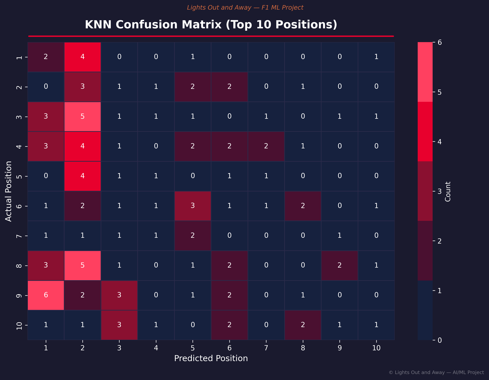
*KNN classifier performance across finishing positions (top 10)*

### ⚖️ Algorithm Comparison — Race Winner Prediction
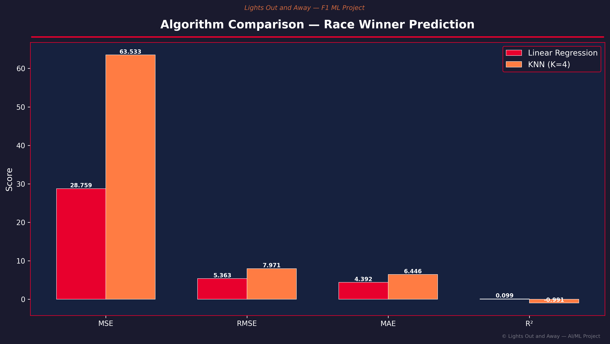
*LR vs KNN side-by-side on MSE, RMSE, MAE, R²*

### 🔧 Pit Stop Duration by Team (Violin Plot)
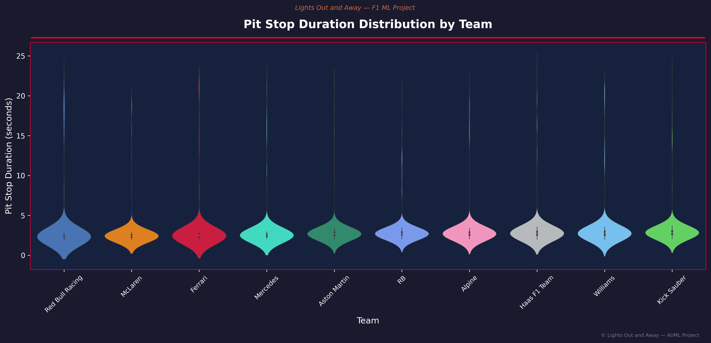
*Distribution of pit stop durations per team, colored by team colors*

### 📉 Residual Analysis — Pit Stop Prediction
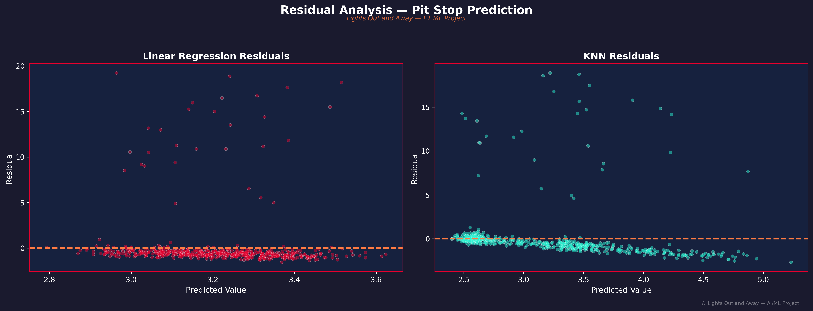
*LR and KNN residual plots for pit stop duration prediction*

### ⚖️ Algorithm Comparison — Pit Stop Duration
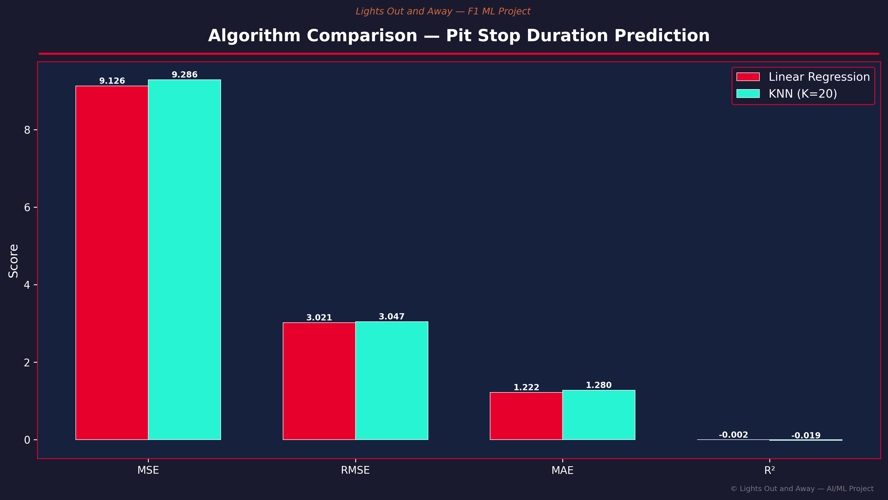
*LR vs KNN on RMSE, MAE, R² for pit stop duration*

### 📈 Learning Curves
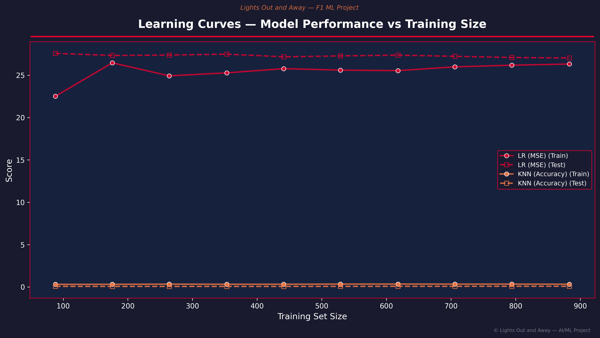
*How model performance improves with more training data*

### 🏅 Feature Importance
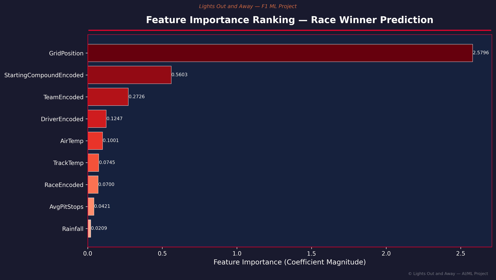
*Which features matter most — GridPosition dominates*

---

### Full List of All 26 Plots

| # | Plot | Problem |
|---|------|---------|
| 1 | Race Calendar Heatmap | Data Overview |
| 2 | Driver Performance Radar | Data Overview |
| 3 | Team Performance Bar Chart | Data Overview |
| 4 | Circuit Difficulty Chart | Data Overview |
| 5 | Tyre Compound Usage Pie | Data Overview |
| 6 | Feature Correlation Heatmap | Problem 1 |
| 7 | Grid vs Finishing Position Scatter | Problem 1 |
| 8 | LR Actual vs Predicted | Problem 1 |
| 9 | KNN Confusion Matrix | Problem 1 |
| 10 | KNN Accuracy vs K Value | Problem 1 |
| 11 | Algorithm Comparison (Winner) | Problem 1 |
| 12 | Top 10 Predicted Winners | Problem 1 |
| 13 | Driver Win Probability Heatmap | Problem 1 |
| 14 | Pit Stop Violin by Team | Problem 2 |
| 15 | Pit Stop vs Lap Number Scatter | Problem 2 |
| 16 | LR Actual vs Predicted (Pit Stop) | Problem 2 |
| 17 | KNN Actual vs Predicted (Pit Stop) | Problem 2 |
| 18 | Residual Analysis | Problem 2 |
| 19 | Algorithm Comparison (Pit Stop) | Problem 2 |
| 20 | Pit Stop by Circuit Boxplot | Problem 2 |
| 21 | Tyre Compound vs Pit Stop Violin | Problem 2 |
| 22 | Team Pit Stop Ranking | Problem 2 |
| 23 | Learning Curves | Advanced |
| 24 | Cross-Validation Score Distribution | Advanced |
| 25 | Feature Importance Ranking | Advanced |
| 26 | Season Comparison | Advanced |

---

## 🔧 Installation

### Prerequisites
- Python 3.10 or higher
- pip (Python package manager)

### Steps

```bash
# 1. Clone or download the project
cd lights-out-and-away

# 2. Create a virtual environment (recommended)
python -m venv venv
source venv/bin/activate        # macOS/Linux
# or
venv\Scripts\activate           # Windows

# 3. Install dependencies
pip install -r requirements.txt
```

---

## 🚀 How to Run

### Run Everything with One Command

```bash
python main.py
```

This will:
1. 🏎️ Collect F1 data from 3 seasons (skip if cached)
2. 🔧 Preprocess and engineer features
3. 🏆 Train winner prediction models (LR + KNN)
4. ⏱️ Train pit stop prediction models (LR + KNN)
5. 📊 Generate all 26+ F1-themed visualizations
6. 📄 Generate the professional PDF report

### Run Individual Steps

```bash
# Data collection only
python -m src.data_collection

# Preprocessing only
python -m src.preprocessing

# Winner prediction only
python -m src.winner_prediction

# Pit stop prediction only
python -m src.pitstop_prediction
```

### Jupyter Notebook

```bash
jupyter notebook notebooks/analysis.ipynb
```

---

## 📁 Project Structure

```
lights-out-and-away/
├── cache/                          # FastF1 cache (auto-generated)
├── data/
│   ├── raw/                        # Raw CSVs from FastF1
│   │   ├── race_data_raw.csv
│   │   ├── qualifying_data_raw.csv
│   │   ├── pitstop_data_raw.csv
│   │   ├── weather_data_raw.csv
│   │   ├── circuit_data_raw.csv
│   │   └── tyre_data_raw.csv
│   └── processed/                  # Cleaned, encoded data
│       ├── race_winner_data.csv
│       ├── pitstop_duration_data.csv
│       ├── race_full_processed.csv
│       ├── pitstop_full_processed.csv
│       └── encoder_mappings.csv
├── models/                         # Saved ML models (joblib)
│   ├── winner_linear_regression.joblib
│   ├── winner_knn_classifier.joblib
│   ├── pitstop_linear_regression.joblib
│   └── pitstop_knn_regressor.joblib
├── outputs/
│   ├── plots/                      # All 26+ PNG visualizations (300 DPI)
│   └── reports/
│       └── lights_out_and_away_report.pdf
├── src/
│   ├── __init__.py
│   ├── data_collection.py          # FastF1 data fetching
│   ├── preprocessing.py            # Cleaning, encoding, splitting
│   ├── winner_prediction.py        # Problem 1: Race winner (LR + KNN)
│   ├── pitstop_prediction.py       # Problem 2: Pit stop (LR + KNN)
│   ├── visualizations.py           # All 26+ F1-themed plots
│   └── report_generator.py         # FPDF2 PDF generation
├── notebooks/
│   └── analysis.ipynb              # Complete Jupyter notebook walkthrough
├── main.py                         # Single entry point — runs everything
├── requirements.txt                # Pinned Python dependencies
└── README.md                       # This file
```

---

## 🙏 Acknowledgements

- **[FastF1](https://docs.fastf1.dev/)** — The incredible Python library that makes F1 data accessible
- **[Scikit-learn](https://scikit-learn.org/)** — Machine learning algorithms and evaluation tools
- **[Matplotlib](https://matplotlib.org/)** & **[Seaborn](https://seaborn.pydata.org/)** — Visualization libraries
- **[Pandas](https://pandas.pydata.org/)** & **[NumPy](https://numpy.org/)** — Data manipulation and computation
- **[FPDF2](https://py-pdf.github.io/fpdf2/)** — PDF report generation
- **[Formula 1](https://www.formula1.com/)** — The world's greatest motorsport

---

## 📄 License

This project is licensed under the MIT License — see the [LICENSE](LICENSE) file for details.

---

<p align="center">
  <b>🏎️ LIGHTS OUT AND AWAY WE GO! 🏁</b>
</p>
